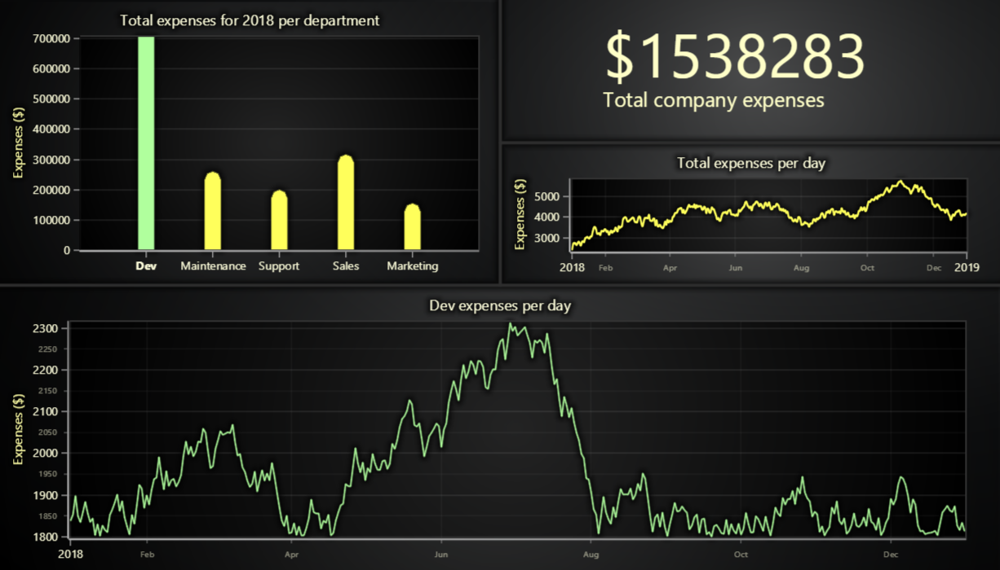

# JavaScript Business Dashboard



This demo application belongs to the set of examples for LightningChart JS, data visualization library for JavaScript.

LightningChart JS is entirely GPU accelerated and performance optimized charting library for presenting massive amounts of data. It offers an easy way of creating sophisticated and interactive charts and adding them to your website or web application.

The demo can be used as an example or a seed project. Local execution requires the following steps:

-   Make sure that relevant version of [Node.js](https://nodejs.org/en/download/) is installed
-   Open the project folder in a terminal:

          npm install              # fetches dependencies
          npm start                # builds an application and starts the development server

-   The application is available at _http://localhost:8080_ in your browser, webpack-dev-server provides hot reload functionality.


## Description

The data visualization tools are widely used in all fields of industries. This example shows the specific business case to visualize the costs of the _imaginary company_ across all the departments for the whole year combined in a single interactive dashboard.

#### Dashboard layout

The dashboard grid is created with 4 rows and 2 columns. Some visualization components in this example fill multiple cells by explicitly providing a row- & column- span during the creation.

1. _Top-left cell._ The cell contains a chart that shows the costs per year for each department using **_Bar Chart or Column Chart_** implemented with **_SegmentSeries_** different tool than **_RectangleSeries_**. Segment series provides an ability to create and place freely line segments by specifying the start & end.

    ```javascript
    // Create XY chart and attach to the dashboard.
    const barChart = dashboard.createChartXY({
        columnIndex: 2,
        rowIndex: 0,
        columnSpan: 2,
        rowSpan: 1,
    })

    // Add segment series to series individual line segments.
    // This series uses default axes.
    const bars = barChart.addSegmentSeries()
    ```

    The segment series accepts input in the following format { startX: number, startY: number, endX: number, endY: number }. The series returns the created line segment to give an ability of further modifications. The chart fills 2 rows & 1 column.

    ```javascript
    // Add line segment.
    const column = bars.add({
        startX: 10,
        startY: 10,
        endX: 20,
        endY: 20,
    })
    ```

    Regarding the customization, each column can be configured to have individual styling and mouse & touch events. Each chart and series has mouse/touch events. Search in our API documentation by starting to type "onMouse".

    ```javascript
    // Configure the created bar column.
    column
        .setStrokeStyle( style => ... )
        .onMouseEnter( () => pointerEnterHandler )
        .onTouchEvent( () => pointerEnterHandler )
    ```

2. _Top-right cell, upper part._ This cell contains a UI panel that shows the total company costs for the whole year. UI panels are able to visualize only UI components. The chart fills 1 row & 1 column.

    ```javascript
    // Create UI panel and attach to the dashboard.
    const panel = dashboard.createUIPanel({
        columnIndex: 3,
        rowIndex: 1,
        columnSpan: 1,
        rowSpan: 1,
    })

    // Add UI element specifying the builder.
    // E.g. CheckBox, Button, Legend, etc.
    panel.addUIElement(/* builder from the library */)
    ```

3. _Top-right cell, lower part._ This cell contains a chart which shows the only costs for a single department for each day of the year. The chart renders the line series with data gathered by moving the mouse over the column in the bar chart. The chart fills 1 row & 1 column.

    ```javascript
    // Decide on an origin for DateTime axes.
    const dateTimeTickStrategy = AxisTickStrategies.DateTime(new Date(2018, 0, 1))

    // Create a chart for visualizing the costs of selected department.
    // Specify DateTime format for x-axis labels.
    const lineChart = dashboard.createChartXY({
        columnIndex: 2,
        rowIndex: 1,
        columnSpan: 1,
        rowSpan: 1,
        chartXYOptions: { defaultAxisXTickStrategy: dateTimeTickStrategy },
    })

    // Create line series for elected department.
    const lineSeries = lineChart.addLineSeries()
    ```

4. _Bottom cell._ This cell contains a chart which shows the smooth line ( using **_SplineSeries_** ) of total costs across all the apartments during the whole year. The chart fills 2 rows & 2 columns.

    ```javascript
    // Create a chart for visualizing the total costs of the company.
    // Specify DateTime format for x-axis labels similarly as before.
    const totalCostsChart = dashboard.createChartXY({
        columnIndex: 0,
        rowIndex: 0,
        columnSpan: 2,
        rowSpan: 2,
        chartXYOptions: { defaultAxisXTickStrategy: dateTimeTickStrategy },
    })

    // Create line series for total costs of the company.
    const lineSeries = lineChart.addSplineSeries()
    ```


## API Links

* [Dashboard]
* [XY cartesian chart]
* [Axis]
* [Axis tick strategies]
* [Auto cursor modes]
* [Segment series]
* [Freeform line series]
* [Spline series]
* [Custom tick]
* [Solid LineStyle]
* [Empty LineStyle]
* [Solid FillStyle]
* [Empty FillStyle]
* [Empty TickStyle]
* [Color palettes]
* [UI Panel]
* [UI Layout builders]
* [UI Elements builders]
* [Font settings]


## Support

If you notice an error in the example code, please open an issue on [GitHub][0] repository of the entire example.

Official [API documentation][1] can be found on [LightningChart][2] website.

If the docs and other materials do not solve your problem as well as implementation help is needed, ask on [StackOverflow][3] (tagged lightningchart).

If you think you found a bug in the LightningChart JavaScript library, please contact support@lightningchart.com.

Direct developer email support can be purchased through a [Support Plan][4] or by contacting sales@lightningchart.com.

[0]: https://github.com/Arction/
[1]: https://lightningchart.com/lightningchart-js-api-documentation/
[2]: https://lightningchart.com
[3]: https://stackoverflow.com/questions/tagged/lightningchart
[4]: https://lightningchart.com/support-services/

© LightningChart Ltd 2009-2022. All rights reserved.


[Dashboard]: https://lightningchart.com/js-charts/api-documentation/v4.2.0/classes/Dashboard.html
[XY cartesian chart]: https://lightningchart.com/js-charts/api-documentation/v4.2.0/classes/ChartXY.html
[Axis]: https://lightningchart.com/js-charts/api-documentation/v4.2.0/classes/Axis.html
[Axis tick strategies]: https://lightningchart.com/js-charts/api-documentation/v4.2.0/variables/AxisTickStrategies.html
[Auto cursor modes]: https://lightningchart.com/js-charts/api-documentation/v4.2.0/enums/AutoCursorModes.html
[Segment series]: https://lightningchart.com/js-charts/api-documentation/v4.2.0/classes/SegmentSeries.html
[Freeform line series]: https://lightningchart.com/js-charts/api-documentation/v4.2.0/classes/LineSeries.html
[Spline series]: https://lightningchart.com/js-charts/api-documentation/v4.2.0/classes/SplineSeries.html
[Custom tick]: https://lightningchart.com/js-charts/api-documentation/v4.2.0/classes/CustomTick.html
[Solid LineStyle]: https://lightningchart.com/js-charts/api-documentation/v4.2.0/classes/SolidLine.html
[Empty LineStyle]: https://lightningchart.com/js-charts/api-documentation/v4.2.0/variables/emptyLine.html
[Solid FillStyle]: https://lightningchart.com/js-charts/api-documentation/v4.2.0/classes/SolidFill.html
[Empty FillStyle]: https://lightningchart.com/js-charts/api-documentation/v4.2.0/variables/emptyFill-1.html
[Empty TickStyle]: https://lightningchart.com/js-charts/api-documentation/v4.2.0/variables/emptyTick.html
[Color palettes]: https://lightningchart.com/js-charts/api-documentation/v4.2.0/variables/ColorPalettes.html
[UI Panel]: https://lightningchart.com/js-charts/api-documentation/v4.2.0/classes/UIPanel.html
[UI Layout builders]: https://lightningchart.com/js-charts/api-documentation/v4.2.0/variables/UILayoutBuilders.html
[UI Elements builders]: https://lightningchart.com/js-charts/api-documentation/v4.2.0/variables/UIElementBuilders.html
[Font settings]: https://lightningchart.com/js-charts/api-documentation/v4.2.0/classes/FontSettings.html

